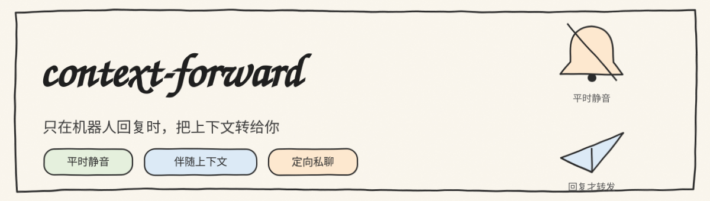
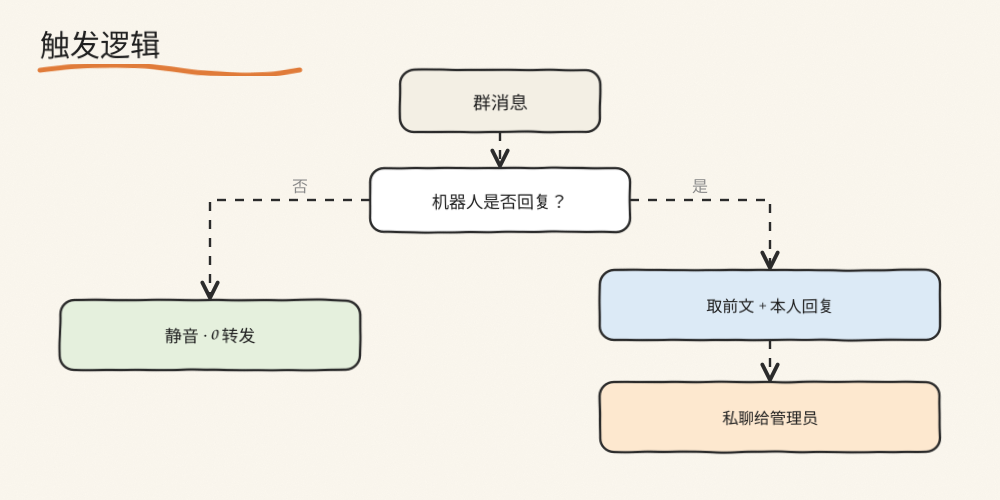

<div align="center">



[](https://www.python.org/)
[](https://v2.nonebot.dev/)
[](./LICENSE)

只在机器人真正参与对话时，才把上下文转发给管理员；其余群聊消息一律不打扰。

</div>

---

## 它解决什么问题

群机器人常见的转发实现是监听**所有**群消息、按条数或时间聚合后转发。结果是管理员被大量与机器人无关的闲聊刷屏，真正需要关注的信息反而被淹没。

本项目改为**事件驱动**：不再监听全部消息，而是当机器人**确实回复了**某条群聊时才触发一次转发，并附带触发它的前文上下文。

---

## 触发逻辑

<div align="center">

</div>

- 机器人未参与 → 不转发；
- 机器人已参与 → 组装 `【群名 + 最近若干条前文 + 机器人回复】`，私聊给管理员。

---

## 设计

与“监听所有消息再过滤”不同，本插件不在全局 `on_message` 上做事，而是暴露一个由宿主调用的钩子。宿主在**回复成功之后**调用它，插件再从上下文存储中读取触发这一轮的对话，组装通知。

```
宿主(机器人) ──回复成功──► notify(group_id, reply)
                               │
                               ├─ 读取上下文存储（前文若干条）
                               ├─ 组装 群名 + 前文 + 回复
                               └─ 私聊管理员
```

这样做的直接好处：

- 转发量与实际参与量正相关，不再有无关刷屏；
- 通知自带前因后果，管理员无需再翻聊天记录；
- 不绑定具体聊天插件，任何机器人都可以调用该钩子。

---

## 使用

```python
from nonebot_plugin_context_forward import notify_master_replied

# 在机器人回复成功后调用
await notify_master_replied(
    group_id=str(event.group_id),
    reply="晚上上号不，缺个车队",
)
```

若使用 pxchat，可开启内置钩子（默认关闭）。钩子在 `send_split_messages` 发送成功后触发，读取 `px_chat_context.json` 中的最近会话作为前文。

---

## 配置

```dotenv
CF_MASTER=10001      # 接收通知的管理员 QQ
CF_ENABLE=true       # 是否启用内置钩子
CF_QUIET_START=23    # 夜间静音开始（小时）
CF_QUIET_END=8       # 夜间静音结束（小时）
```

---

## 设计权衡

| 选择 | 原因 | 代价 |
|---|---|---|
| 事件驱动而非全量监听 | 杜绝无关转发 | 需要宿主在回复后显式调用钩子 |
| 通知包含前文 | 通知自解释 | 需读取上下文存储 |
| 夜间静音 | 避免打扰 | 夜间来源的通知会延后 |

---

## 兼容性

| 依赖 | 版本 |
|---|---|
| Python | 3.10+ |
| NoneBot2 | 2.x |
| 上下文存储 | 默认读取 pxchat 的 `px_chat_context.json`，也支持自定义读取器 |

## License

[MIT](./LICENSE)
